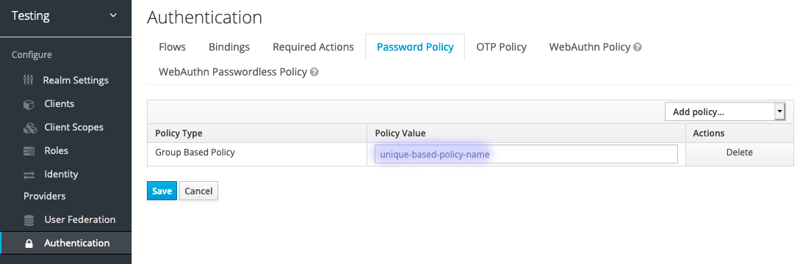
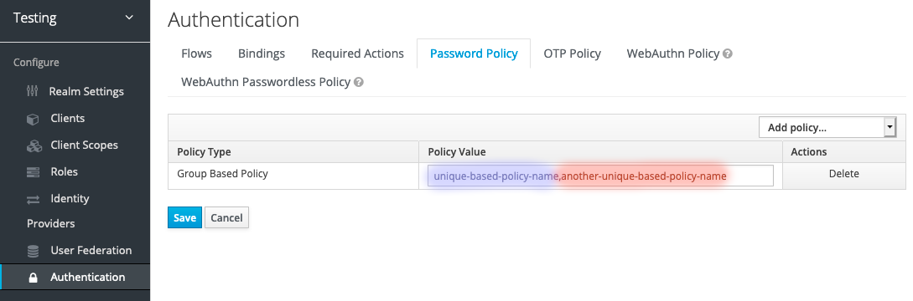
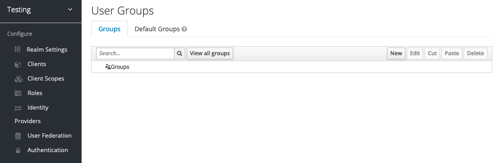
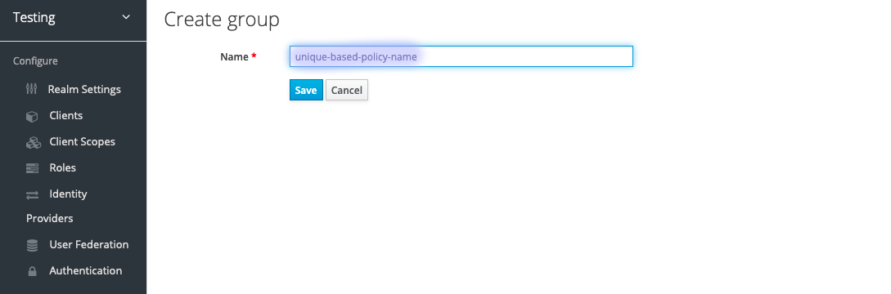
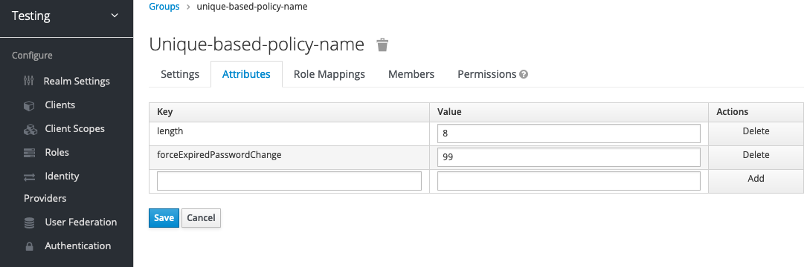
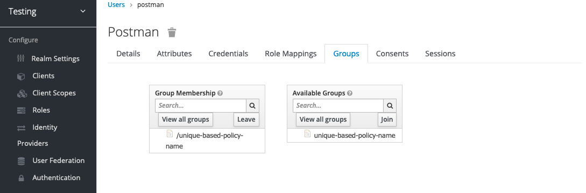

# Keycloak User Group Based Password Policy

This is and extension for [Keycloak](https://www.keycloak.org/)

## Features

With this **unofficial** Keycloak extension is possible to create a separate Password Policy per Realm group. The extension is based on logic from the extension [keycloak-group-password-policy](https://github.com/jpicht/keycloak-group-password-policy/)

The extension creates a new type of Password Policy.

## Setup

### Installation

#### Keycloak v.11.x
Download `keycloak-user-group-based-password-policy-1.0.0.jar` from Releases page (or from jar directory). Then deploy it into `$KEYCLOAK_HOME/standalone/deployments/` directory.

#### Keycloak v.12.x
Download `keycloak-user-group-based-password-policy-2.0.0.jar` from Releases page (or from jar directory). Then deploy it into `$KEYCLOAK_HOME/standalone/deployments/ directory`.

#### Keycloak v.14.x
Download `keycloak-user-group-based-password-policy-3.0.0.jar` from Releases page (or from jar directory). Then deploy it into `$KEYCLOAK_HOME/standalone/deployments/ directory`.

### Creating a new Password policy with type **Group Based Policy**




### Create new Realm Group




### Realm Group (For the Group Based Password Policy) attributes

Based on the [Keycloak Password Policy Types](https://www.keycloak.org/docs/latest/server_admin/index.html#password-policy-types)

| Identifier    | Type | Example | Parameter description                | Tested |
| ------------- | ---- | ------- |:------------------------------------ | ------ |
| `length` | integer | 8 | minimum number of unicode characters | ✓ |
| `digits` | integer | 2 | minimum number of digits             | ✓ |
| `lowerCase` | integer | 2 | minimum number of lower case unicode characters | ✓ |
| `upperCase` | integer | 2 | minimum number of upper case unicode characters | ✓ |
| `specialChars` | integer | 2 | minumum number of special characters | ✓ |
| `regexPattern` | string | `java.util.regex.Pattern` | regular expression | ✓ |
| `notUsername` | void |  |  | ✓ |
| `passwordBlacklist` | string | `pass_blck_list.txt` | file name | - |
| `passwordHistory` | integer | 1 | number of last used passwords to disallow | - |
| `forceExpiredPasswordChange` | integer | 99 | number of days to expire password after | - |
| `hashAlgorithm` | string | PBKDF2 | hash algorithm to use when hashing the password | - |
| `hashIterations` | integer | 27,500 | number of hash iterations | - |



### Group Membership

Do not forget join user to your group



## For Developers

### Build

The extension can be compiled by the following command:

```
mvn clean install
```

Afterwards, there is a sub-directory called `target` with the archive file `keycloak-user-group-based-password-policy-X.X.X.jar`.

In a development setup you may build and deploy the extension using the alternative command:

```
mvn clean install wildfly:deploy
```

### Testing

```
```

### Contribute

Contributions are welcome! You can contribute in different ways:

* Report a bug or ask for an improvement by [creating an Issue](https://github.com/sayedcsekuet/keycloak-user-group-based-password-policy/issues)
* Contribute code, documentation or other content by [creating a Pull/Merge Request](https://github.com/sayedcsekuet/keycloak-user-group-based-password-policy/pulls)

Contributions are subject to the following conditions:

* By contributing you agree to license your contribution under the [project's license](LICENSE)
* You need to have the legal rights to make the contribution (e. g. modification rights or copyright)

## License

[Apache License, Version 2.0](LICENSE)

## Authors

- [Abu Sayed](https://github.com/sayedcsekuet)
- [Asim Husanović](https://github.com/Kolesar)
- [Jaouher Kharrat](https://github.com/JaouherK)
